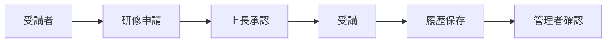
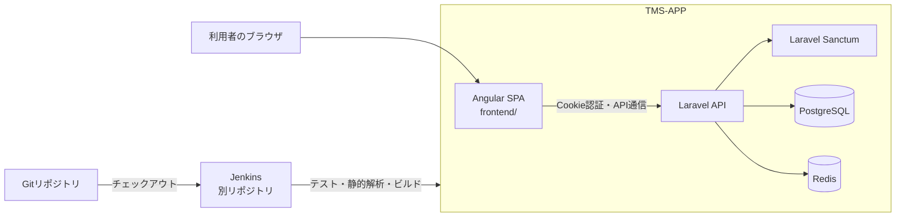
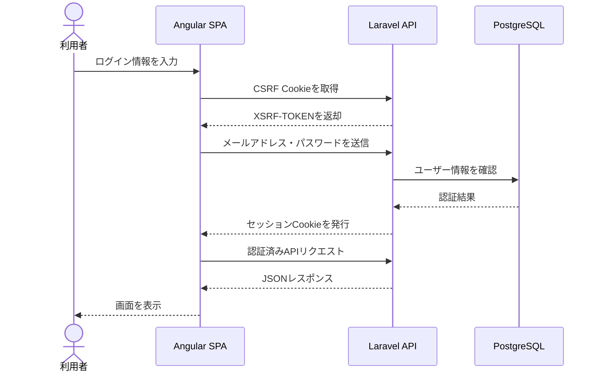

<p align="center"><a href="https://laravel.com" target="_blank"></a></p>

<p align="center">
<a href="https://github.com/laravel/framework/actions"></a>
<a href="https://packagist.org/packages/laravel/framework"></a>
<a href="https://packagist.org/packages/laravel/framework"></a>
<a href="https://packagist.org/packages/laravel/framework"></a>
</p>

## Training Management System

人材育成業務の効率化を目的にした研修管理システムです。
研修の申請・承認・受講履歴管理を一元化し、教育状況の可視化と業務標準化を支援します。

## 背景・課題

研修管理では、次のような課題が生じやすいと考え、それらを解決するために設計しました。

- 研修履歴が属人化している（誰が何を受講したか一元的に把握できない）
- 受講状況の確認に手間がかかる（部署・研修ごとの集計が手作業になりがち）
- 上長が部下の受講進捗を把握しづらい
- 教育計画と実績管理が分断されている

## 主な機能

- 社員情報、所属部署、役職の管理
- 研修の登録・割り当て・進捗管理
- 研修受講の申請・承認（上長・人事の承認フロー、承認者委任）
- 受講状況の確認と履歴管理
- 権限に応じた業務制御
- Laravel Sanctum を用いた SPA 認証
- Angular による管理画面

## 設計方針

- API と画面を分離し、Laravel API + Angular SPA の構成を採用
- 認証は Laravel Sanctum による Cookie ベースの SPA 認証
- 本人／上長／人事の3層スコープでアクセス制御（Policyクラスで一元管理）
- 承認者不在でも業務が止まらないよう、権限の委任を設計に組み込み
- 保守性を重視し、Controller にロジックを持たせず Actions・Policy に分離
- テスト自動化を前提とし、CI 上で Pest / Vitest によるカバレッジを計測

## Quick Start

### 前提
- Docker / Docker Compose
- Node.js

### セットアップ
```bash
make up
make frontend-install
```

### 開発用起動
```bash
make up
make frontend-dev
```

- API: `http://localhost:8000`
- Frontend: `http://localhost:4200`

## 業務フロー



上長が不在の場合は委任された承認者が承認を行い、上長が部下の代理で申請した場合は
上長ではなく人事のみが承認します（判断の重複を避けるため）。

## システム構成

Laravel API と Angular SPA を中心に、開発環境は Docker で構成しています。
CI の実行基盤と運用設定は別リポジトリの Jenkins プロジェクトで管理し、
このリポジトリの Jenkinsfile に定義したパイプラインを実行します。



## 認証フロー



## テスト / CI（Jenkins）

- バックエンドは PCOV、フロントエンドは Vitest (`@vitest/coverage-v8`) を使ってカバレッジを計測します。
- 実行コマンド:

```bash
make test-coverage            # storage/coverage/{html,clover.xml,cobertura.xml}
make frontend-test-coverage   # frontend/coverage/frontend/{index.html,cobertura-coverage.xml}
```

- [`Jenkinsfile`](Jenkinsfile) は同じコマンドを実行し、Cobertura 形式のレポートを Coverage プラグインに、JUnit 形式の結果を JUnit プラグインに渡します。
- Jenkins エージェントには Docker（Compose v2）と Node.js が必要です。PHP 側は `compose.yaml` の Sail ランタイムを使うため、個別に PHP を導入する必要はありません。
- CI 環境の構築・起動方法は [`tms-app-jenkins`](../tms-app-jenkins) を参照してください。

## デバッグ（Xdebug / Debugbar）

- **[barryvdh/laravel-debugbar](https://github.com/barryvdh/laravel-debugbar)**: `make up` で Sail を起動し、ブラウザで `http://localhost:8000` にアクセスすると画面下部にデバッグバーが表示されます。SQL・リクエスト・レスポンス時間などを確認できます。`APP_ENV=local` のときに有効で、`.env` の `DEBUGBAR_ENABLED` で明示的にオン/オフできます。
- **Xdebug + VSCode**: Sail の PHP ランタイムには Xdebug が含まれており、`.env` の `SAIL_XDEBUG_MODE=develop,debug` で有効化できます。VS Code では次の手順でデバッグできます。
  1. PHP Debug 拡張機能をインストール
  2. 「実行とデバッグ」から `Sail: Xdebug をリッスン` を開始
  3. ブレークポイントを設定し、ブラウザまたは API リクエストを発行する

> コンテナ内の `sail` ユーザー UID/GID は `.env` の `WWWUSER` / `WWWGROUP` に合わせて設定されており、ホスト側のファイル書き込み権限不整合を防ぐために使用します。別環境で開発する場合は各自で調整してください。

## 開発方針（AI活用方針）

開発では Claude Code を補助ツールとして活用しました。

- **Claude Code の活用**: Angular の画面実装や定型的なコード作成など、実装の効率化
- **自身が担当した領域**: 要件整理、アーキテクチャ設計、認証・認可設計、
  データモデリング、Laravel API の実装、テスト・CI の構築

AI に任せる部分と自身で設計・検証する部分を明確に分け、
実装後はテストやコードレビューを通して動作と品質を確認したうえで、
最終的な設計判断は自身が行う運用としています。